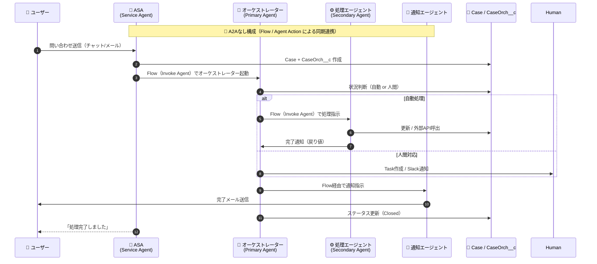

# Agentforce マルチエージェント設計書（A2A不使用方針）

## 🧭 概要

本設計書は、Salesforce Agentforce を活用して構築する  
マルチエージェント型ケース処理システムのアーキテクチャおよび設定方針をまとめたものです。  

本システムはすべて Salesforce 内で完結する構成とし、  
**A2A（Agent-to-Agent）を利用しない** ネイティブFlow連携方式を採用します。

---

## 🎯 目的

- 顧客からの問い合わせ対応を自動化し、処理内容をエージェント間で分担。
- オーケストレーション・自動処理・通知の役割を分離し、保守性・再利用性を高める。
- 外部連携を必要としない範囲で、Agentforceのマルチエージェント機能を最大限活用。

---

## 🧩 システム構成概要

### エージェント構成

| 役割 | タイプ | 主な機能 | 実装形態 |
|------|--------|-----------|-----------|
| **ASA (Service Agent)** | Primary | 顧客からの問い合わせ受付、ケース作成 | Omni-Channel / Agentforce Service Agent |
| **オーケストレーター (Primary Agent)** | Primary | 処理振り分け（自動 or 人間） | Agentforce Custom Agent + Flow |
| **処理エージェント (Secondary Agent)** | Secondary | 自動処理・外部API連携など | Agentforce Custom Agent + Flow/Apex |
| **通知エージェント (Secondary Agent)** | Secondary | 顧客への完了通知送信 | Agentforce Custom Agent + Flow |
| **人間オペレーター** | Human | 自動化不能なケース対応 | Service Console or Slack通知 |

---

## ⚙️ 処理フロー

### 処理概要
1. ASAが問い合わせを受信し、Case + CaseOrch__cレコードを作成。  
2. オーケストレーターが判断を行い、自動対応可能であれば処理エージェントに指示。  
3. 人間対応が必要な場合はService Consoleにタスクを作成。  
4. 処理エージェントが完了後、通知エージェントに連絡。  
5. 通知エージェントが顧客に完了メールを送信。  
6. オーケストレーターがCaseステータスを更新しクローズ。

---

## 🪄 シーケンス図（A2A不使用構成）

---

## 🧱 実装マッピング

| 項目 | 実装内容 | 備考 |
|------|-----------|------|
| **データモデル** | `Case`（標準）＋ `CaseOrch__c`（カスタム） | 処理状態・履歴・理由を管理 |
| **ASA** | Flow + Omni-Channel設定 | ケース作成とエージェント起動トリガー |
| **オーケストレーター** | Agentforce Custom Agent + Flow | 自動／人間対応の分岐 |
| **処理エージェント** | Agentforce Custom Agent + Flow/Apex | 外部APIコールやケース更新 |
| **通知エージェント** | Agentforce Custom Agent + Email Action | 完了メール送信 |
| **人間対応** | Service Console / Slack通知 | FlowからTaskまたはWebhook発火 |

---

## 🧩 CaseOrch__c 設計例

| 項目名 | 型 | 用途 |
|--------|----|------|
| `Case__c` | Lookup(Case) | 対応ケース |
| `CurrentStage__c` | Picklist | Processing / Human / Notified / Closed |
| `DecisionReason__c` | LongText | オーケストレーター判断理由（LLM要約） |
| `LastAgent__c` | Text | 最終実行エージェント名 |
| `IsEscalated__c` | Checkbox | エスカレーションフラグ |

---

## 🚫 A2Aを使わない理由と判断根拠

| 観点 | 内容 |
|------|------|
| **アーキテクチャの単純化** | 全エージェントが同一Salesforce Org内で動作するため、A2Aによるセッション管理は不要。 |
| **運用安定性** | Flow・標準ログで可観測性が十分。A2A導入による複雑性を回避。 |
| **開発スピード** | Flow＋Agentforce標準連携で迅速に開発・デプロイ可能。 |
| **拡張性確保** | 将来A2A導入を見据え、Agent呼び出し部分をサブフロー化しておくことで差し替え可能。 |

---

## 🔮 将来的な拡張方針（A2A導入を見据えて）

- 将来的に外部エージェント（社内LLM / 外部ナレッジベース）と連携する場合は、A2Aプロトコルを導入。  
- その際は以下の構成変更を想定：
  - `Flow.InvokeAgent` 呼び出しを `Apex.A2ARequestHandler` に置き換え。
  - `CaseOrch__c` に `A2ASessionId__c` を追加。
  - 各エージェントを疎結合マイクロサービス化（非同期通信対応）。

---

## ⚠️ リスクと対策

| リスク | 対策 |
|--------|------|
| エージェントの失敗時に処理が中断 | Flow Fault Pathで人間オペレーターに通知 |
| フローの肥大化 | サブフロー分割、各エージェントを独立Flowとして管理 |
| LLM判断の誤判定 | オーケストレーター出力を `DecisionReason__c` に保存、監査可視化 |
| 通知ミス | 通知エージェントが `Case.Status` を Closed に変更後のみ送信 |

---

## ✅ 運用チェックリスト

- [ ] ASA → Case作成時に `CaseOrch__c` が自動生成される  
- [ ] Flowの呼び出し順序：ASA → ORC → SEC → NOT  
- [ ] すべてのFlowに Fault Path（失敗ハンドラ）を定義  
- [ ] CaseOrch__c の `CurrentStage__c` が一貫して更新される  
- [ ] メールテンプレートがエージェントIDに依存しない構成になっている  

---

## 🧠 まとめ

- Salesforce内完結の構成では **A2A不要**。  
- Flow + Agentforce Action により、安定した同期連携を実現。  
- `CaseOrch__c` により、マルチエージェント間の状態・判断理由・実行履歴を一元管理。  
- 将来的にA2Aを導入する場合にも、拡張可能な設計。

---
