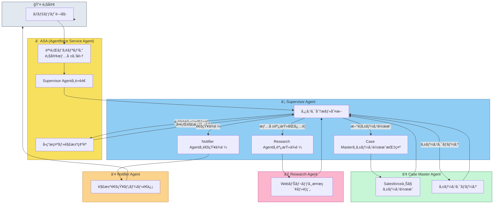
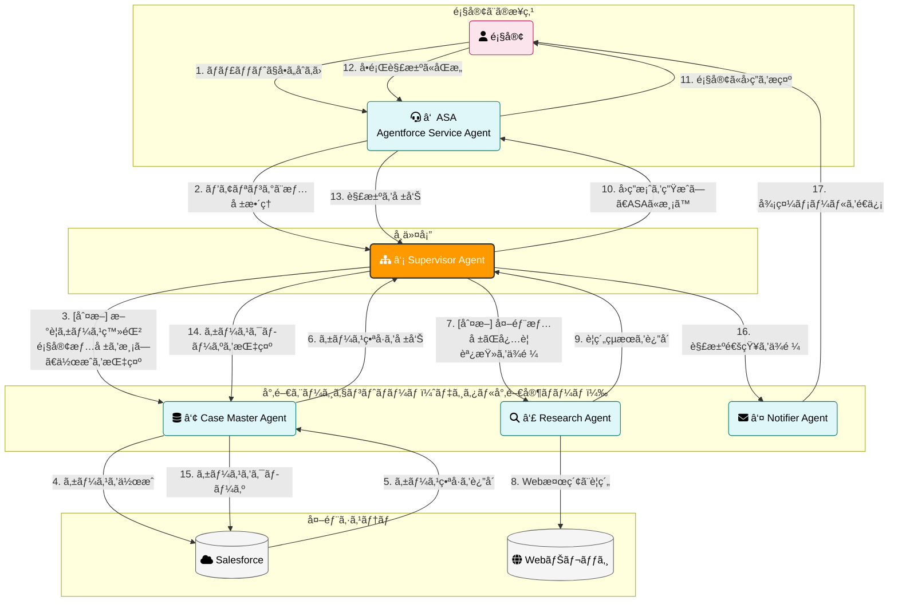
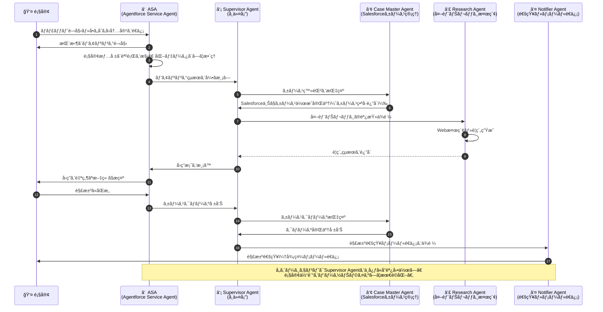

### キーワード
- ヘッドレスエージェント
- ãƒãƒ«ãƒã‚¨ãƒ¼ã‚¸ã‚§ãƒ³ãƒˆã€Œ**デジタル専門家ãƒãƒ¼ãƒ **ã€
- パーソナライズ

---

### ãƒãƒ«ãƒã‚¨ãƒ¼ã‚¸ã‚§ãƒ³ãƒˆã«ã‚ˆã‚‹å”調モデル

全体ã®å¸ä»¤å¡”ã¨ãªã‚‹**Supervisor Agent**（監ç£ã‚¨ãƒ¼ã‚¸ã‚§ãƒ³ãƒˆï¼‰ã‚’中心ã«ã€å„機能ã«ç‰¹åŒ–ã—ãŸè¤‡æ•°ã®ã‚¨ãƒ¼ã‚¸ã‚§ãƒ³ãƒˆã‚’連æºã•ã›ã‚‹æ§‹æˆã§ã™ã€‚

#### 登場ã™ã‚‹ã‚¨ãƒ¼ã‚¸ã‚§ãƒ³ãƒˆ
1.  **â‘  ASA (Agentforce Service Agent)**：顧客ã¨ã®å¯¾è©±ã‚’担当ã™ã‚‹ãƒ•ãƒ­ãƒ³ãƒˆã‚¨ãƒ¼ã‚¸ã‚§ãƒ³ãƒˆã€‚
2.  **â‘¡ Supervisor Agent**：å„エージェントã¸ã®ã‚¿ã‚¹ã‚¯å‰²ã‚ŠæŒ¯ã‚Šã‚’è¡Œã†å¸ä»¤å¡”。
3.  **â‘¢ Case Master Agent**：Salesforceã®ã‚±ãƒ¼ã‚¹ç™»éŒ²ãƒ»ç®¡ç†ã‚’å°‚é–€ã«è¡Œã†ã‚¨ãƒ¼ã‚¸ã‚§ãƒ³ãƒˆã€‚
4.  **â‘£ Research Agent**：外部Webサイトã‹ã‚‰ãƒŠãƒ¬ãƒƒã‚¸ã‚’検索・è¦ç´„ã™ã‚‹ã‚¨ãƒ¼ã‚¸ã‚§ãƒ³ãƒˆã€‚
5.  **⑤ Notifier Agent**：メール通知ãªã©ã€ã‚¢ã‚¦ãƒˆãƒã‚¦ãƒ³ãƒ‰é€šä¿¡ã‚’担当ã™ã‚‹ã‚¨ãƒ¼ã‚¸ã‚§ãƒ³ãƒˆã€‚

---

### 具体的ãªå‡¦ç†ãƒ•ãƒ­ãƒ¼

顧客ãŒãƒãƒ£ãƒƒãƒˆã‚’開始ã—ã¦ã‹ã‚‰è§£æ±ºé€šçŸ¥ã‚’å—ã‘å–ã‚‹ã¾ã§ã®æµã‚Œã‚’ã€å„エージェントã®å½¹å‰²ã«æ²¿ã£ã¦èª¬æ˜ã—ã¾ã™ã€‚

#### **ステップ1：ãƒãƒ£ãƒƒãƒˆå—付ã¨ãƒ’アリング**
* **担当エージェント**: `① ASA (Agentforce Service Agent)`
* **処ç†å†…容**:
    * 顧客ã‹ã‚‰ã®ãƒãƒ£ãƒƒãƒˆã‚’å—ã‘付ã‘ã€ä¼šè©±ã‚’開始ã—ã¾ã™ã€‚
    * 自然ãªå¯¾è©±ã‚’通ã˜ã¦ã€é¡§å®¢ã®èª²é¡Œã‚„è¦ä»¶ï¼ˆåå‰ã€é€£çµ¡å…ˆã€å•é¡Œã®æ¦‚è¦ãªã©ï¼‰ã‚’ヒアリングã—ã¾ã™ã€‚
    * å集ã—ãŸæƒ…報を構造化ã•ã‚ŒãŸãƒ‡ãƒ¼ã‚¿ã¨ã—ã¦ä¿æŒã—ã¾ã™ã€‚

#### **ステップ2：タスクã®æŒ¯ã‚Šåˆ†ã‘ã¨ã‚±ãƒ¼ã‚¹èµ·ç¥¨**
* **担当エージェント**: `② Supervisor Agent` → `③ Case Master Agent`
* **処ç†å†…容**:
    1.  ASAãŒãƒ’アリングを終ãˆã‚‹ã¨ã€`â‘¡ Supervisor Agent`ã«å‡¦ç†ã‚’引ã渡ã—ã¾ã™ã€‚
    2.  Supervisor Agentã¯å¯¾è©±å†…容を分æã—ã€ã€Œã“ã‚Œã¯æ–°è¦ã‚±ãƒ¼ã‚¹ç™»éŒ²ãŒå¿…è¦ãªã‚¿ã‚¹ã‚¯ã ã€ã¨åˆ¤æ–­ã—ã¾ã™ã€‚
    3.  顧客情報ã¨å•é¡Œã®æ¦‚è¦ã‚’`â‘¢ Case Master Agent`ã«æ¸¡ã—ã€ã‚±ãƒ¼ã‚¹ä½œæˆã‚’指示ã—ã¾ã™ã€‚
    4.  Case Master Agentã¯å—ã‘å–ã£ãŸãƒ‡ãƒ¼ã‚¿ã‚’å…ƒã«Salesforce上ã§ã‚±ãƒ¼ã‚¹ã‚’作æˆã—ã€ã‚±ãƒ¼ã‚¹ç•ªå·ã‚’Supervisor Agentã«è¿”å´ã—ã¾ã™ã€‚

#### **ステップ3：Webナレッジã®æ¤œç´¢ã¨å›ç­”生æˆ**
* **担当エージェント**: `② Supervisor Agent` → `④ Research Agent`
* **処ç†å†…容**:
    1.  Supervisor Agentã¯ã€ã‚±ãƒ¼ã‚¹å†…容ã®è§£æ±ºã«ã¯å¤–部情報ãŒå¿…è¦ã ã¨åˆ¤æ–­ã—ãŸå ´åˆã€`â‘£ Research Agent`ã«èª¿æŸ»ã‚’ä¾é ¼ã—ã¾ã™ã€‚
    2.  Research Agentã¯ã€æŒ‡å®šã•ã‚ŒãŸã‚­ãƒ¼ãƒ¯ãƒ¼ãƒ‰ã§Webを検索ã—ã€é–¢é€£æ€§ã®é«˜ã„情報をå集・è¦ç´„ã—ã¾ã™ã€‚
    3.  è¦ç´„ã—ãŸãƒŠãƒ¬ãƒƒã‚¸ã‚’Supervisor Agentã«è¿”å´ã—ã¾ã™ã€‚
    4.  Supervisor Agentã¯ã€ãã®ãƒŠãƒ¬ãƒƒã‚¸ã‚’`â‘  ASA`ã«æ¸¡ã—ã€é¡§å®¢ã¸ã®å›ç­”案ã¨ã—ã¦æ示ã•ã›ã¾ã™ã€‚ASAã¯ãれを自然ãªæ–‡ç« ã«æ•´ãˆã¦é¡§å®¢ã«è¿”ä¿¡ã—ã¾ã™ã€‚

#### **ステップ4：ケースクローズã¨è§£æ±ºå¾Œé€šçŸ¥**
* **担当エージェント**: `② Supervisor Agent` → `③ Case Master Agent` → `⑤ Notifier Agent`
* **処ç†å†…容**:
    1.  顧客ãŒãƒãƒ£ãƒƒãƒˆã§å•é¡Œè§£æ±ºã«åŒæ„ã™ã‚‹ã¨ã€ASAã¯ãã®æ—¨ã‚’`â‘¡ Supervisor Agent`ã«å ±å‘Šã—ã¾ã™ã€‚
    2.  Supervisor Agentã¯`â‘¢ Case Master Agent`ã«ã‚±ãƒ¼ã‚¹ã®ã‚¯ãƒ­ãƒ¼ã‚ºã‚’指示ã—ã¾ã™ã€‚
    3.  ケースクローズãŒå®Œäº†ã—ãŸã‚‰ã€Supervisor Agentã¯`⑤ Notifier Agent`ã«ã€Œè§£æ±ºé€šçŸ¥ãƒ¡ãƒ¼ãƒ«ã€ã®é€ä¿¡ã‚’ä¾é ¼ã—ã¾ã™ã€‚
    4.  Notifier Agentã¯ã€æŒ‡å®šã•ã‚ŒãŸãƒ†ãƒ³ãƒ—レートã¨é¡§å®¢æƒ…報を使ã£ã¦å¾¡ç¤¼ãƒ¡ãƒ¼ãƒ«ã‚’é€ä¿¡ã—ã¾ã™ã€‚

---

## 🧠 構æˆå›³ï¼ˆç°¡æ˜“版）

```mermaid
graph TD

%% =========================
%% ãƒãƒ¼ãƒ‰å®šç¾©
%% =========================

subgraph Customer["👤 顧客"]
    A0["ãƒãƒ£ãƒƒãƒˆé–‹å§‹"]
end

subgraph ASA["â‘  ASA (Agentforce Service Agent)"]
    A1["課題ヒアリング<br/>顧客情報をå集"]
    A2["Supervisor Agentã¸è»¢é€"]
    A3["å›ç­”æ示・解決確èª"]
end

subgraph Supervisor["â‘¡ Supervisor Agent"]
    S1["タスク分æ・判断"]
    S2["Case Masterã¸ã‚±ãƒ¼ã‚¹ä½œæˆæŒ‡ç¤º"]
    S3["Research Agentã¸èª¿æŸ»ä¾é ¼"]
    S4["Notifier Agentã¸é€šçŸ¥ä¾é ¼"]
end

subgraph CaseMaster["â‘¢ Case Master Agent"]
    C1["Salesforce上ã§<br/>ケース作æˆ"]
    C2["ケースクローズ"]
end

subgraph Research["â‘£ Research Agent"]
    R1["Webナレッジ検索・è¦ç´„"]
end

subgraph Notifier["⑤ Notifier Agent"]
    N1["解決通知メールé€ä¿¡"]
end

%% =========================
%% フロー（矢å°ï¼‰
%% =========================

Customer --> A0 --> A1 --> A2
A2 --> S1

S1 -->|æ–°è¦ã‚±ãƒ¼ã‚¹ä½œæˆ| S2 --> C1 --> S1
S1 -->|情報調査ãŒå¿…è¦| S3 --> R1 --> S1
S1 -->|顧客å›ç­”指示| A3

A3 -->|å•é¡Œè§£æ±ºå ±å‘Š| S1 -->|ケースクローズ| C2 --> S1
S1 -->|通知ä¾é ¼| S4 --> N1 --> Customer

%% =========================
%% スタイル設定
%% =========================

style ASA fill:#f6e05e,stroke:#b7791f,stroke-width:1px
style Supervisor fill:#90cdf4,stroke:#2b6cb0,stroke-width:1px
style CaseMaster fill:#c6f6d5,stroke:#2f855a,stroke-width:1px
style Research fill:#fbb6ce,stroke:#b83280,stroke-width:1px
style Notifier fill:#fbd38d,stroke:#b7791f,stroke-width:1px
style Customer fill:#e2e8f0,stroke:#4a5568,stroke-width:1px
```

## 🧠 構æˆå›³

```mermaid
graph TD
    subgraph "顧客ã¨ã®æ¥ç‚¹"
        Customer(fa:fa-user 顧客)
        ASA(fa:fa-headset â‘  ASA<br>Agentforce Service Agent)
    end

    subgraph "å¸ä»¤å¡”"
        Supervisor(fa:fa-sitemap â‘¡ Supervisor Agent)
    end

    subgraph "専門エージェントãƒãƒ¼ãƒ ï¼ˆãƒ‡ã‚¸ã‚¿ãƒ«å°‚門家ãƒãƒ¼ãƒ ï¼‰"
        CaseMaster(fa:fa-database â‘¢ Case Master Agent)
        Research(fa:fa-search â‘£ Research Agent)
        Notifier(fa:fa-envelope ⑤ Notifier Agent)
    end

    subgraph "外部システム"
        Salesforce[(fa:fa-cloud Salesforce)]
        Web[(fa:fa-globe Webナレッジ)]
    end

    %% ステップ1：ãƒãƒ£ãƒƒãƒˆå—付ã¨ãƒ’アリング
    Customer -- 1. ãƒãƒ£ãƒƒãƒˆã§å•ã„åˆã‚ã› --> ASA
    ASA -- 2. ヒアリングã¨æƒ…å ±æ•´ç† --> Supervisor

    %% ステップ2：タスクã®æŒ¯ã‚Šåˆ†ã‘ã¨ã‚±ãƒ¼ã‚¹èµ·ç¥¨
    Supervisor -- 3. [判断] æ–°è¦ã‚±ãƒ¼ã‚¹ç™»éŒ²<br>顧客情報を渡ã—ã€ä½œæˆã‚’指示 --> CaseMaster
    CaseMaster -- 4. ã‚±ãƒ¼ã‚¹ã‚’ä½œæˆ --> Salesforce
    Salesforce -- 5. ケース番å·ã‚’è¿”å´ --> CaseMaster
    CaseMaster -- 6. ケース番å·ã‚’報告 --> Supervisor

    %% ステップ3：Webナレッジã®æ¤œç´¢ã¨å›ç­”生æˆ
    Supervisor -- 7. [判断] 外部情報ãŒå¿…è¦<br>調査をä¾é ¼ --> Research
    Research -- 8. Web検索ã¨è¦ç´„ --> Web
    Research -- 9. è¦ç´„çµæœã‚’è¿”å´ --> Supervisor
    Supervisor -- 10. å›ç­”案を生æˆã—ã€ASAã«æ¸¡ã™ --> ASA
    ASA -- 11. 顧客ã«å›ç­”ã‚’æ示 --> Customer

    %% ステップ4：ケースクローズã¨è§£æ±ºå¾Œé€šçŸ¥
    Customer -- 12. å•é¡Œè§£æ±ºã«åŒæ„ --> ASA
    ASA -- 13. 解決を報告 --> Supervisor
    Supervisor -- 14. ケースクローズを指示 --> CaseMaster
    CaseMaster -- 15. ケースをクローズ --> Salesforce
    Supervisor -- 16. 解決通知をä¾é ¼ --> Notifier
    Notifier -- 17. 御礼メールをé€ä¿¡ --> Customer

    %% スタイリング
    classDef supervisor fill:#ff9900,color:#fff,stroke:#333,stroke-width:2px
    classDef agent fill:#e0f7fa,color:#000,stroke:#00796b,stroke-width:1px
    classDef customer fill:#fce4ec,color:#000,stroke:#c2185b,stroke-width:1px
    classDef external fill:#f5f5f5,color:#000,stroke:#616161,stroke-width:1px

    class Supervisor supervisor
    class ASA,CaseMaster,Research,Notifier agent
    class Customer customer
    class Salesforce,Web external
```

## 🧠 シーケンス図

```mermaid
sequenceDiagram
    autonumber
    participant Customer as 👤 顧客
    participant ASA as â‘  ASA<br>(Agentforce Service Agent)
    participant Supervisor as â‘¡ Supervisor Agent<br>(å¸ä»¤å¡”)
    participant CaseMaster as â‘¢ Case Master Agent<br>(Salesforceケース管ç†)
    participant Research as ④ Research Agent<br>(外部ナレッジ検索)
    participant Notifier as ⑤ Notifier Agent<br>(通知・メールé€ä¿¡)

    %% --- ステップ1 ---
    Customer->>ASA: ãƒãƒ£ãƒƒãƒˆé–‹å§‹ãƒ»å•ã„åˆã‚ã›å†…容をé€ä¿¡
    ASA->>Customer: 挨拶ã¨ãƒ’アリング開始
    ASA->>ASA: 顧客情報ã¨èª²é¡Œã‚’構造化データã¨ã—ã¦æ•´ç†

    %% --- ステップ2 ---
    ASA->>Supervisor: ヒアリングçµæœã‚’引ã渡ã—
    Supervisor->>CaseMaster: ケース登録を指示
    CaseMaster->>Supervisor: Salesforce上ã§ã‚±ãƒ¼ã‚¹ä½œæˆå®Œäº†ï¼ˆã‚±ãƒ¼ã‚¹ç•ªå·è¿”å´ï¼‰

    %% --- ステップ3 ---
    Supervisor->>Research: 外部ナレッジã®èª¿æŸ»ä¾é ¼
    Research->>Research: Web検索・è¦ç´„生æˆ
    Research-->>Supervisor: è¦ç´„çµæœã‚’è¿”å´
    Supervisor->>ASA: å›ç­”案を渡ã™
    ASA->>Customer: å›ç­”を自然ãªæ–‡ç« ã§æ示

    %% --- ステップ4 ---
    Customer->>ASA: 解決ã«åŒæ„
    ASA->>Supervisor: ケースクローズ報告
    Supervisor->>CaseMaster: ケースクローズ指示
    CaseMaster->>Supervisor: クローズ完了報告
    Supervisor->>Notifier: 解決通知メールé€ä¿¡ã‚’ä¾é ¼
    Notifier->>Customer: 解決通知＆御礼メールé€ä¿¡

    Note over ASA,Notifier: å„エージェントã¯Supervisor Agentを中心ã«å”調動作ã—ã€<br>顧客体験をパーソナライズã—ã¦æœ€é©åŒ–。
```

