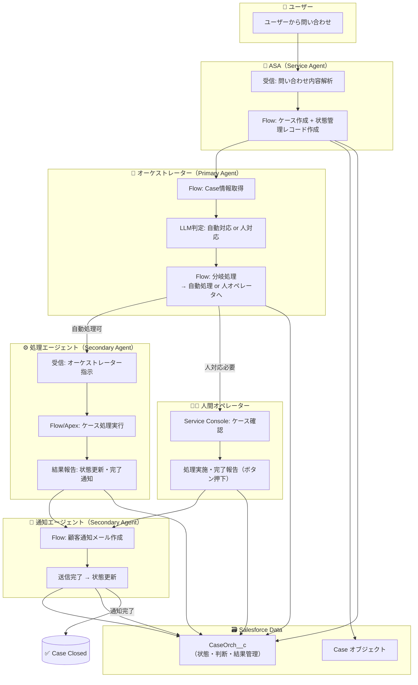
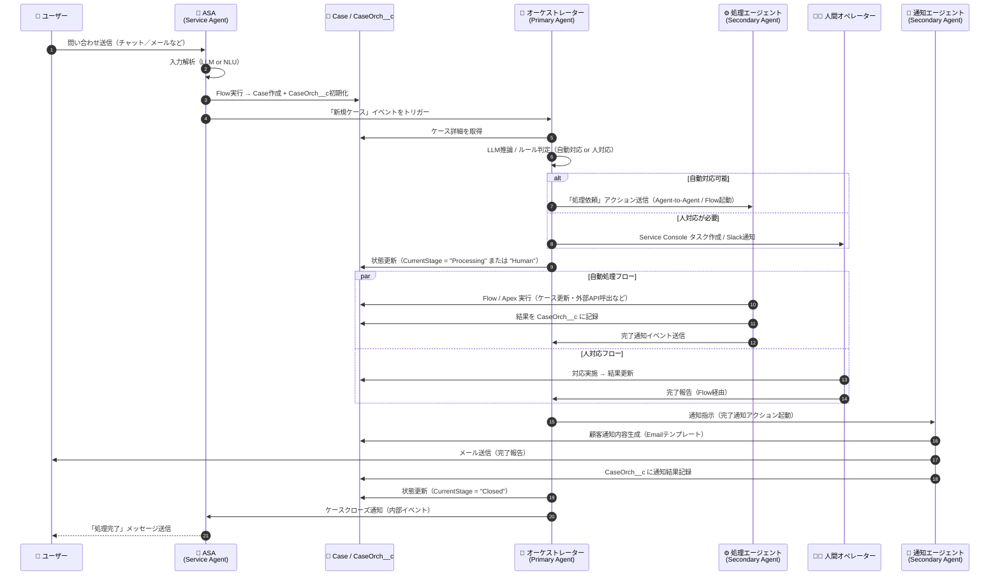

```mermaid
flowchart TD

%% エージェント定義
subgraph UserSide["👤 ユーザー"]
    UQ[ユーザーから問い合わせ]
end

subgraph ASA["🤖 ASA（Service Agent）"]
    ASA1[受信: 問い合わせ内容解析]
    ASA2[Flow: ケース作成 + 状態管理レコード作成]
end

subgraph Primary["🧭 オーケストレーター（Primary Agent）"]
    ORC1[Flow: Case情報取得]
    ORC2[LLM判定: 自動対応 or 人対応]
    ORC3[Flow: 分岐処理<br>→ 自動処理 or 人オペレータへ]
end

subgraph Processing["⚙️ 処理エージェント（Secondary Agent）"]
    SEC1[受信: オーケストレーター指示]
    SEC2[Flow/Apex: ケース処理実行]
    SEC3[結果報告: 状態更新・完了通知]
end

subgraph Human["👨‍💼 人間オペレーター"]
    HUM1[Service Console: ケース確認]
    HUM2[処理実施・完了報告（ボタン押下）]
end

subgraph Notify["📩 通知エージェント（Secondary Agent）"]
    NOT1[Flow: 顧客通知メール作成]
    NOT2[送信完了 → 状態更新]
end

%% データレイヤ
subgraph Data["🗃️ Salesforce Data"]
    CASE[Case オブジェクト]
    ORCH[CaseOrch__c<br>（状態・判断・結果管理）]
end

%% フロー関係
UQ --> ASA1 --> ASA2 --> ORC1
ORC1 --> ORC2 --> ORC3

ORC3 -->|自動処理可| SEC1
SEC1 --> SEC2 --> SEC3 --> NOT1
NOT1 --> NOT2 --> ORCH

ORC3 -->|人対応必要| HUM1 --> HUM2 --> NOT1

%% データ更新
ASA2 --> CASE
ASA2 --> ORCH
ORC3 --> ORCH
SEC3 --> ORCH
HUM2 --> ORCH
NOT2 --> ORCH

%% 終了
NOT2 -->|通知完了| END[(✅ Case Closed)]
```

```mermaid
sequenceDiagram
    autonumber

    participant User as 👤 ユーザー
    participant ASA as 🤖 ASA<br>(Service Agent)
    participant Case as 📄 Case / CaseOrch__c
    participant ORC as 🧭 オーケストレーター<br>(Primary Agent)
    participant SEC as ⚙️ 処理エージェント<br>(Secondary Agent)
    participant Human as 👨‍💼 人間オペレーター
    participant NOT as 📩 通知エージェント<br>(Secondary Agent)

    %% 1. ユーザー問い合わせ
    User->>ASA: 問い合わせ送信（チャット／メールなど）
    ASA->>ASA: 入力解析（LLM or NLU）
    ASA->>Case: Flow実行 → Case作成 + CaseOrch__c初期化
    ASA->>ORC: 「新規ケース」イベントをトリガー

    %% 2. オーケストレーター判断
    ORC->>Case: ケース詳細を取得
    ORC->>ORC: LLM推論 / ルール判定（自動対応 or 人対応）
    alt 自動対応可能
        ORC->>SEC: 「処理依頼」アクション送信（Agent-to-Agent / Flow起動）
    else 人対応が必要
        ORC->>Human: Service Console タスク作成 / Slack通知
    end
    ORC->>Case: 状態更新（CurrentStage = "Processing" または "Human"）

    %% 3. 処理エージェントの実行
    par 自動処理フロー
        SEC->>Case: Flow / Apex 実行（ケース更新・外部API呼出など）
        SEC->>Case: 結果を CaseOrch__c に記録
        SEC->>ORC: 完了通知イベント送信
    and 人対応フロー
        Human->>Case: 対応実施 → 結果更新
        Human->>ORC: 完了報告（Flow経由）
    end

    %% 4. 通知フロー
    ORC->>NOT: 通知指示（完了通知アクション起動）
    NOT->>Case: 顧客通知内容生成（Emailテンプレート）
    NOT->>User: メール送信（完了報告）
    NOT->>Case: CaseOrch__c に通知結果記録

    %% 5. 最終更新
    ORC->>Case: 状態更新（CurrentStage = "Closed"）
    ORC->>ASA: ケースクローズ通知（内部イベント）
    ASA-->>User: 「処理完了」メッセージ送信
```
